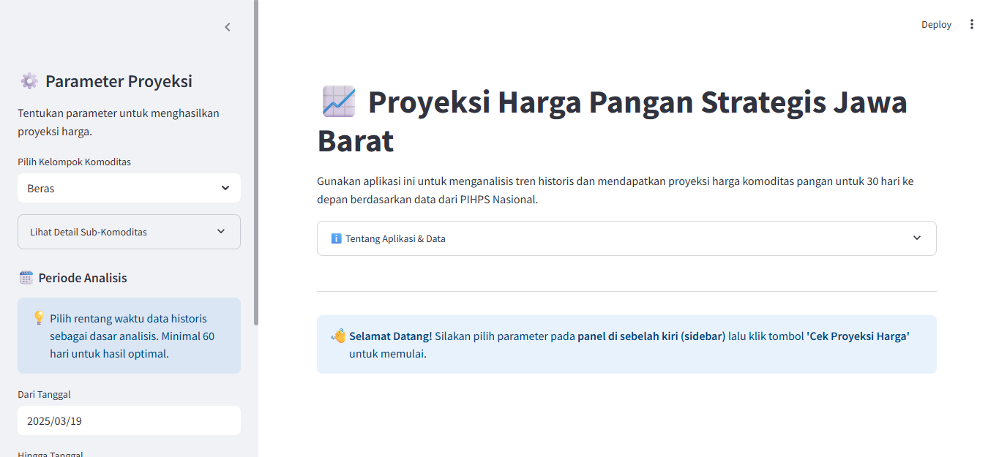

## **📈 Proyeksi Harga Pangan**
Aplikasi web sederhana untuk memprediksi harga beberapa komoditas pangan di Jawa Barat menggunakan model Deep Learning (LSTM).



## **Sumber Data**
- Data harga komoditas diambil dari **PIHPS Bank Indonesia**.
  - URL: `https://www.bi.go.id/hargapangan/WebSite/TabelHarga`
- Model harga historis untuk komoditas seperti **Beras**, **Telur Ayam**, dan **Minyak Goreng** dilatih menggunakan algoritma deep learning LSTM dengan arsitektur model terbaik untuk tiap komoditasnya.
- Daftar komoditas dan harga didasarkan pada data real-time.

## **Prerequisite**
Sebelum memulai, pastikan sudah menginstal dependensi yang diperlukan. Beberapa yang akan dibutuhkan:
- Python 3.7 atau lebih tinggi
- `pip` untuk menginstal package

## **Installation**
1. Clone repository: 
    ```
    git clone https://github.com/nama-anda/nama-repo-ini.git
    cd nama-repo-ini
    ```
2. Install dependency:
   ```
   pip install -r requirements.txt
    ```
3. Run aplikasi:
    ```
   streamlit run app.py
    ```